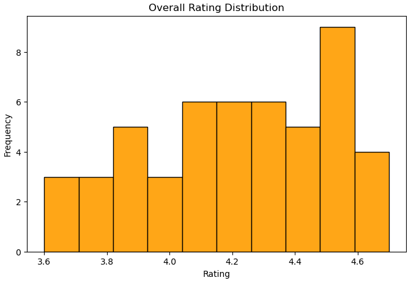
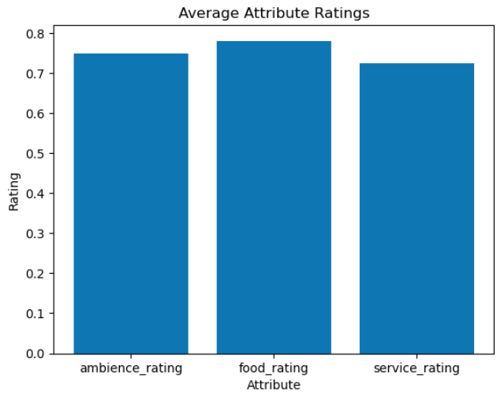
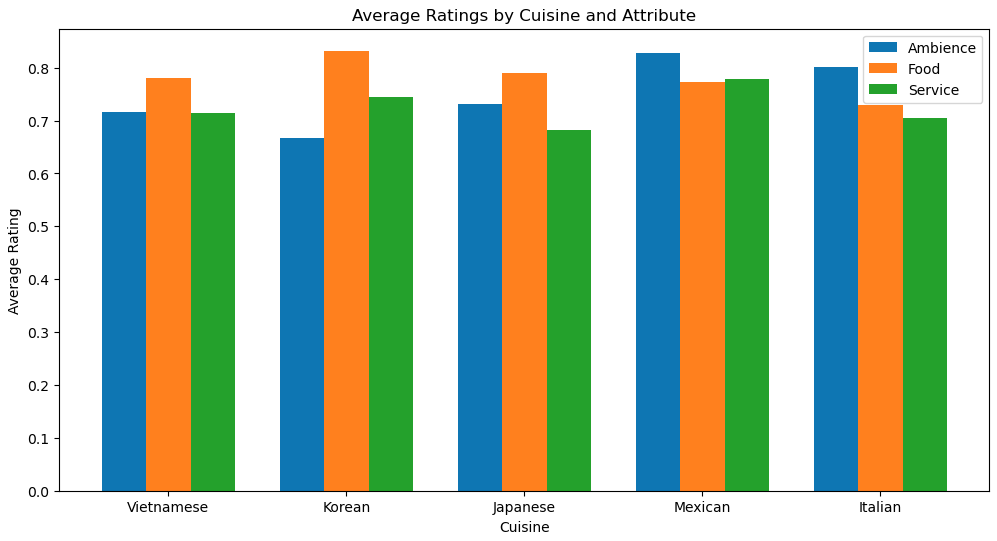

# Yelp Ratings & Restaurant Attributes (Orange County)

## Overview
This project analyzes how restaurant attributes such as food quality, ambience, and service influence Yelp ratings across five cuisine types in Orange County, CA.

## Business Questions
- Which restaurant attributes influence Yelp ratings the most?
- Do these factors differ across cuisines (Vietnamese, Korean, Japanese, Mexican, Italian)?

## Why This Matters
Understanding what drives customer ratings can help restaurants prioritize improvements and tailor the dining experience to what customers value most.

## Dataset
Manually collected Yelp data (50 restaurants total: 10 per cuisine) using Yelp’s Review Insights attribute mentions:
- Ambience
- Food quality
- Service

## Methods
- Data cleaning + preparation
- Exploratory Data Analysis (EDA) with matplotlib visualizations
- Statistical testing (ANOVA + regression)

## Key Findings
- Overall Yelp ratings did not differ significantly across cuisines
- The only significant difference found was in ambience: Mexican restaurants had a higher proportion of positive ambience-related reviews compared to Korean restaurants
- Food quality explained the most variation in overall ratings for most cuisines

## Key Visuals

### Overall Rating Distribution

### Attribute Mention Proportions (Overall)

### Attribute Mentions by Cuisine

## About (Group Project)
This was a group project completed during my MSBA coursework at UC Irvine. I contributed to data loading/EDA, matplotlib visualizations, and helped develop the final report and presentation. Statistical analysis (ANOVA + regression) was completed collaboratively by the team.

## Files
- `yelp_analysis.ipynb` - notebook with EDA + workflow
- `/slides/yelp_project_slides.pdf` - final presentation deck
- `/report/yelp_final_report.pdf` - written report
